# Futurdata Thesis / Disassembly Flow Diagram Builder

## Design Requirement Specification Document

DIBRIS – Università di Genova. Scuola Politecnica, Corso di Ingegneria del Software 80154

 <b> Authors </b>   Nicolas Rodriguez   Lucía Bezares García   María Begines Tirado   Katia Amorós Cristea   Davide Ferrando   Arbaz Khan 

### REVISION HISTORY

Version | Date | Author(s) | Notes
---------|------|-----------|------
1.0 | 18/06/2026 | All contributors | First consolidated version of the Design Requirement Specification, based on the consolidated URS and the repository source code.

## Table of Content

1. [Introduction](#intro)
    1. [Purpose and Scope](#purpose)
    2. [Definitions](#def)
    3. [Document Overview](#overview)
    4. [Bibliography](#biblio)
2. [Project Description](#description)
    1. [Project Introduction](#project-intro)
    2. [Technologies used](#tech)
    3. [Assumptions and Constraints](#constraints)
3. [System Overview](#system-overview)
    1. [System Architecture](#architecture)
    2. [System Interfaces](#interfaces)
    3. [System Data](#data)
        1. [System Inputs](#inputs)
        2. [System Outputs](#outputs)
    4. [Graphical User Interface](#gui)
4. [System Module 1](#sys-module-1)
    1. [Structural Diagrams](#sd)
        1. [Class Diagram](#cd)
            1. [Class Description](#cd-description)
        2. [Use Case Diagram](#ucd)
    2. [Dynamic Models](#dm)
        1. [Activity Diagram](#activity)
        2. [Sequence Diagrams](#sequence)
        3. [State Diagrams](#state)

##  1 Introduction

This document describes the design of the **Futurdata Thesis / Disassembly Flow Diagram Builder**, a desktop software application that lets users create, edit, visualise, and save graphical disassembly diagrams. A diagram models how a technical product — such as a printer — is taken apart, through a graph of components, disassembly steps, detailed actions, decision branches, and directed connections.

###  1.1 Purpose and Scope

The purpose of this document is to describe the technical design solution for the Disassembly Flow Diagram Builder. It is intended for the software engineering students, teachers, designers, and developers involved in the project.

The scope includes the main system structure, the main classes, the main use cases, the dynamic behaviour of the system, and the lifecycle of a disassembly diagram. The document is aligned with the consolidated User Requirements Specification (URS) and prepares the ground for implementation and testing. It maps the existing Python source code architecture to UML structural and dynamic models.

###  1.2 Definitions

| Term | Definition |
| ------------- | ------------- |
| DRS | Design Requirement Specification. |
| URS | User Requirements Specification. |
| UML | Unified Modeling Language. |
| GUI | Graphical User Interface. |
| JSON | JavaScript Object Notation, used for diagram serialisation. |
| DB | Database. |
| Diagram | A graphical representation of a disassembly procedure, holding shapes and connections. |
| Shape | Abstract base domain entity for a drawable canvas element (`ComponentBox`, `ActionCircle`, `DiamondStep`, `ArrowShape`). |
| Component | A physical part or assembly of the product, modelled by a `ComponentBox` (Root, Composite, or Leaf). |
| Step | A main disassembly operation, modelled by an `ActionCircle`. |
| Action | A detailed operation or decision inside a step, modelled by a `DiamondStep`. |
| Connection | A directed logical link binding a source shape to a target shape. |
| Command | An object encapsulating an editing transaction, providing forward execution and reversal (undo). |
| Canvas | The graphical area (`DiagramCanvas`) where the diagram is drawn and edited. |
| AppController | Main controller coordinating user actions, model updates, command history, and view refreshes. |
| DiagramSerializer | Component responsible for saving and loading diagrams in JSON. |
| DatabaseManager | Component responsible for maintaining the local SQLite database. |

###  1.3 Document Overview

The document is organised as follows:

- Section 1 introduces the document purpose, scope, and technical definitions.
- Section 2 describes the project background, the technologies used, and the core design assumptions and constraints.
- Section 3 presents the layered system overview, interface methods, system inputs, and system outputs.
- Section 4 presents the structural and dynamic UML models mapping the Python source code architecture of the main module.

###  1.4 Bibliography

- Software Engineering course material (Introduction, Process Model, Requirements Engineering).
- UML documentation and notation references.
- Consolidated User Requirements Specification (URS) document for the Disassembly Flow Diagram Builder.
- Python Tkinter Canvas and ttk GUI subsystem reference documentation.
- Source code of the Futurdata disassembly diagram builder (`github.com/mnarizzano/futurdata-thesis`).

##  2 Project Description

###  2.1 Project Introduction

The Disassembly Flow Diagram Builder is a desktop graphical tool designed for the technical documentation of disassembly procedures. It supports representing a product as a hierarchy of components and decomposing the disassembly process into steps and detailed actions, so that a user can understand, sequence, and graphically display how a complex object comes apart.

The system allows a technical user to:

- create a new disassembly diagram;
- place, move, and edit disassembly elements (components, steps, actions, decisions) on an interactive canvas;
- connect elements with directed arrows to represent the procedure flow, including conditional branches and retry loops;
- edit element properties (name, material, colour, weight, tool, description, image, etc.);
- execute backward/forward state history rollbacks (Undo/Redo via keyboard shortcuts);
- save and load diagrams, maintaining structured information in a local SQLite database and in portable JSON files, with unsaved-change prompts.

The software is particularly suitable for cases such as printer disassembly, where a service manual describes a complex sequence of operations that must be transformed into a graphical model.

###  2.2 Technologies used

- **Python 3** — core programming language.
- **Tkinter & ttk** — desktop GUI framework for the workspace layout (`MainWindow`, toolbars, `DiagramCanvas` event bindings, `PropertiesPanel`, `AddColorDialog`, `AddMaterialDialog`).
- **SQLite 3** — local relational database for structured data (components, steps, actions, colours, materials, tools, links) via `DatabaseManager`.
- **JSON** — portable serialisation format for exchanging diagrams via `DiagramSerializer`.
- Standard Python libraries for file handling and data management.

###  2.3 Assumptions and Constraints

Assumptions:

- The user has access to a desktop computer and can provide disassembly information from a manual or technical document.
- Each disassembly graph workspace tracks a single active instance of the `Diagram` class, and there is only one Root Component per diagram.
- Each shape has a unique Shape ID.
- Removing a node clears its incoming and outgoing `Connection` references to avoid visual orphans; a connected component cannot be deleted before its connection (arrow) is removed.
- Multiple nodes can be translated simultaneously while retaining alignment guides and grid snapping (`snap_to_grid`).

Constraints:

- The project is a desktop application, not web-based; the GUI is implemented with Tkinter/ttk and persistence is local.
- The system offers a limited, fixed set of node types and focuses on diagram creation and documentation rather than real-time collaboration.
- Connections require valid endpoints and cannot reference missing source or target shapes.
- The current codebase is an academic project and may require refactoring for maintainability.

##  3 System Overview

The system provides six core shape types: `Root Component`, `Leaf Component`, and `Composite Component` (all modelled by `ComponentBox` via a `node_type`), the `Action Circle` (`ActionCircle`), the `Diamond Step` (`DiamondStep`), and the `Arrow` (`ArrowShape`).

The `Root Component` is the main component of the diagram; a `Leaf Component` is a part that cannot be reduced further; and a `Composite Component` is made up of more components. An `Action Circle` describes a disassembly step that must be followed, a `Diamond Step` describes a detailed action (or a YES/NO decision branch) applied within a step, and an `Arrow` is the directed connection between elements.

The user interacts with the canvas and palette; the `AppController` interprets the action, updates the `Diagram` model, records it in the `CommandHistory`, and the model is rendered back through `DiagramCanvas`. Diagram data is also persisted to local JSON files and to the SQLite database.

###  3.1 System Architecture

The system follows a layered, MVC-like architecture that decouples the interface, the logic, and persistence:

- **User layer:** the visual application components — `MainWindow`, `DiagramCanvas`, `PropertiesPanel`, `AddColorDialog`, `AddMaterialDialog` (the `views` package).
- **Application layer:** the `AppController` class, which coordinates canvas mouse interactions, menu triggers, and the transaction history stack manager `CommandHistory`.
- **Domain layer:** the central `Diagram` state aggregate together with the structural primitives `Shape`, `ComponentBox`, `ActionCircle`, `DiamondStep`, `ArrowShape`, and `Connection` (the `models` and `utils` packages).
- **Data layer:** the local SQLite database wrapper `DatabaseManager` and the portable file parser `DiagramSerializer`, which handles JSON transformations.

The implementation approximates MVC even if it is not strict textbook MVC.

###  3.2 System Interfaces

The main user interface functions are: create a diagram, add shapes from a palette, select and move elements, edit element properties, connect nodes, delete elements and connections, view the diagram on the canvas, and save/load/import/export diagrams.

The main internal system interfaces (methods) include:

**Canvas interaction binds**

- `AppController.on_canvas_click(event)`, `on_canvas_drag(event)`, `on_canvas_release(event)`
- `AppController.on_canvas_motion(event)`, `on_canvas_right_click(event)`, `on_escape(event)`
- `AppController.on_mouse_wheel(event)`, `on_shift_mouse_wheel(event)`

**Diagram / file operations**

- `AppController.new_diagram()`, `open_diagram()`, `save_diagram()`
- `AppController.add_shape(shape_type)`, `delete_selected()`, `select_all()`, `toggle_connect_mode()`
- `AppController._create_arrow_connection(from_shape, to_shape)`

**Domain and persistence hooks**

- `Diagram.add_shape(shape)` / `Diagram.remove_shape(shape)` / `Diagram.find_shape_at_point(x, y)`
- `DiagramCanvas.redraw_all(diagram)` / `DiagramCanvas.move_items(...)`
- `PropertiesPanel.load_shape(shape)`
- `DiagramSerializer.save_to_file(diagram, file_path)`
- `CommandHistory.execute(command)` / `undo()` / `redo()`

###  3.3 System Data

The system manages graph elements, their property maps, and structural connections, plus the diagram metadata and the database records for product-related information.

####  3.3.1 System Inputs

| Input | Description |
| ------------- | ------------- |
| Coordinate click | Pointer click events `(x, y)`, resolved via `Diagram.find_shape_at_point`. |
| Motion deltas | Drag offset values `(dx, dy)`, feeding `MoveShapeCommand`. |
| Diagram name | Name of the current project/diagram. |
| Node properties | Name, description, weight value and unit, colour, material, tool, step order, node type, image path. |
| Arrow / connection | Source and target of a connection between two nodes. |
| Serialized graph maps | JSON dictionary object trees restored via `DiagramSerializer`. |
| File path | Path of a saved or loaded diagram file. |

####  3.3.2 System Outputs

| Output | Description |
| ------------- | ------------- |
| Graphical diagram | The diagram rendered on the canvas via `DiagramCanvas.redraw_all`, showing components, steps, actions, and connections. |
| Properties view | Database-driven property form for the selected element, rendered via `PropertiesPanel`. |
| Exported JSON file | Serialized diagram data written to disk via `DiagramSerializer`. |
| Database update | Structured data saved into the local SQLite database via `DatabaseManager`. |
| Status notification | Feedback, confirmation, or warning text published on the status bar via `MainWindow.set_status`. |

###  3.4 Graphical User Interface

This section shows the actual application interface, captured from the running `MainWindow`. The window is organised into a top menu and toolbar, a left **Shape Palette**, a central scrollable **canvas** (`DiagramCanvas`), a right **Properties** panel (`PropertiesPanel`), and a bottom status bar.

**Main window (empty diagram).** On startup the user is presented with the palette of the six shape types, an empty grid canvas, and the properties panel prompting for a selection.

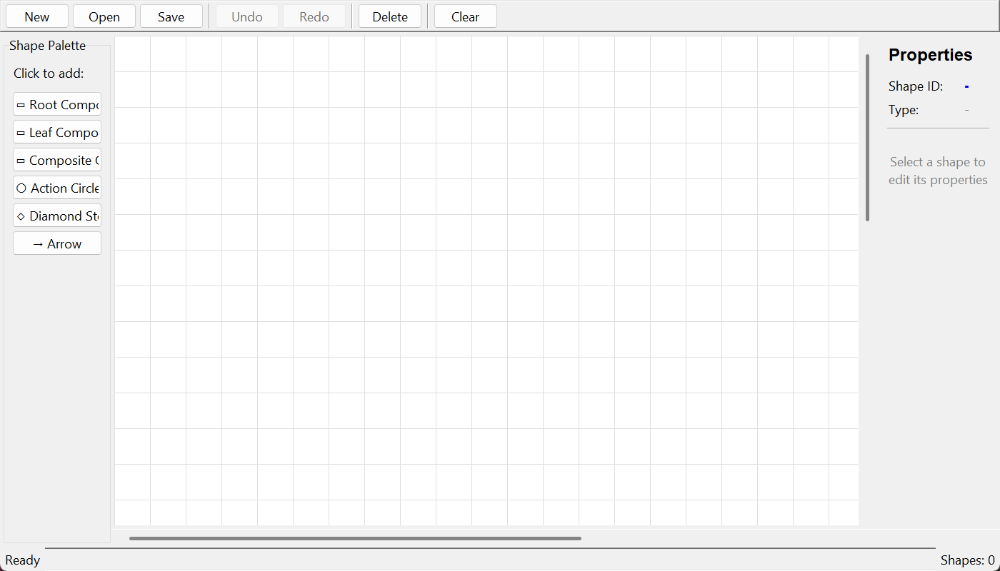

**Diagram loaded.** An example disassembly diagram loaded from a JSON use case is rendered on the canvas, showing the root component, action circles (steps), component boxes, and directed arrows. The status bar reports the opened file and the shape count.

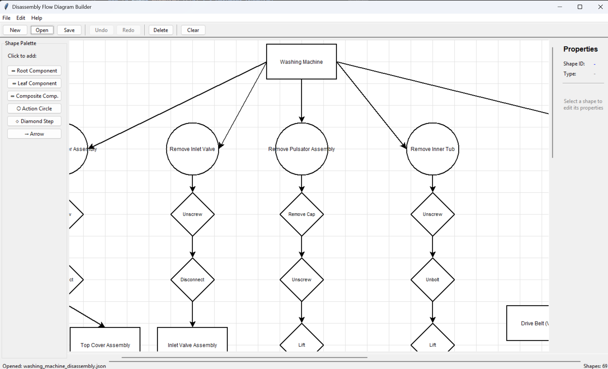

**Element selected — properties panel.** When a shape is selected (here the root product component, highlighted on the canvas), the `PropertiesPanel` populates its database-driven fields — Root Component Id, Colour, Material, Name, Weight, Weight Unit, and Node Type — and exposes the **Apply Changes** action.

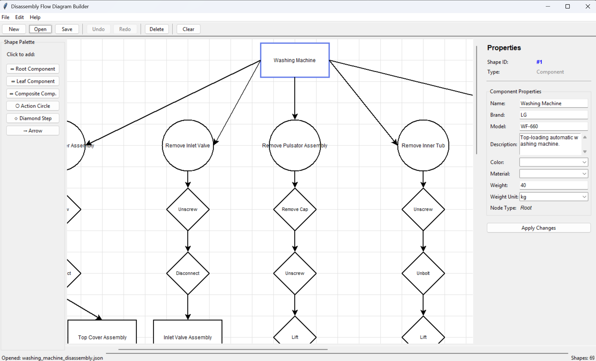

##  4 System Module 1

The main module of the system is the **Diagram Editor Module**. It manages canvas interaction, shape creation and editing, node connections, selection and transformation, undo/redo history, serialisation, and persistence to both SQLite and JSON.

###  4.1 Structural Diagrams

This section presents the static structure of the system.

####  4.1.1 Class Diagram

The class diagram shows the main classes of the system, the inheritance hierarchy under the base `Shape` class, the controller orchestration loop, and the command history stack.

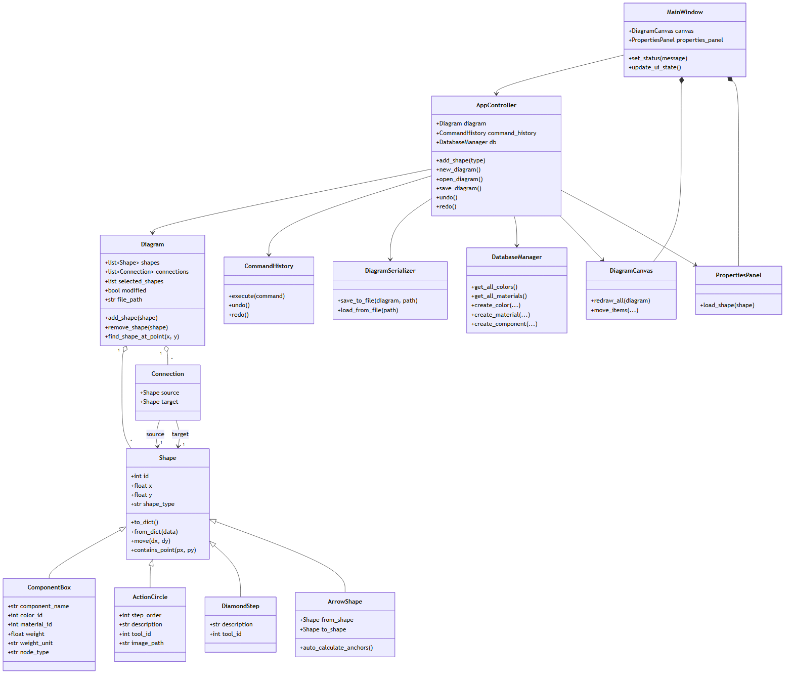

#####  4.1.1.1 Class Description

| Class | Description |
| ------------- | ------------- |
| Diagram | Central data container holding the lists of `shapes` and `connections`, the current selection, file settings, metadata, and the `modified` marker. |
| Shape | Abstract base class for drawable elements, managing the identifier (`id`), grid coordinates `(x, y)`, rendering tags, and the `to_dict` / `from_dict` serialisation hooks. |
| ComponentBox | Inherits from `Shape`; models a physical component (Root, Composite, or Leaf via `node_type`) with attributes such as name, material, colour, weight, and unit. |
| ActionCircle | Inherits from `Shape`; represents a disassembly step, showing step order, instructions, required tool, and reference image. |
| DiamondStep | Inherits from `Shape`; represents a detailed action or a decision (branching) element within a step, with description and tool. |
| ArrowShape | Inherits from `Shape`; the visual directed arrow between two nodes, with automatic anchor calculation. |
| Connection | Models the logical relation binding a source shape to a target shape. |
| AppController | Coordinates user interactions, context menus, model updates, undo/redo history, file validation, database synchronisation, and view refreshes. |
| CommandHistory | Stack manager tracking command objects (`AddShapeCommand`, `RemoveShapeCommand`, `MoveShapeCommand`, `AddConnectionCommand`, `RemoveConnectionCommand`, `EditShapePropertiesCommand`, `MultiCommand`). |
| DiagramSerializer | Validates files and converts diagrams to/from clean JSON. |
| DatabaseManager | Manages the local SQLite storage and schema-related operations, ensuring referential integrity. |
| DiagramCanvas | Handles the graphical rendering of the diagram on the Tkinter canvas. |
| PropertiesPanel | Displays and edits the properties of the selected element, with database-driven fields. |
| MainWindow | Top-level application window that hosts the menu bar, toolbar, shape palette, canvas, properties panel, and status bar, and delegates user actions to the `AppController`. |

Main relationships:

- `Diagram` contains a collection of zero or more `Shape` objects and `Connection` objects.
- `ComponentBox`, `ActionCircle`, `DiamondStep`, and `ArrowShape` inherit from the `Shape` base class.
- `Connection` links one source `Shape` to one target `Shape`.
- `AppController` uses `Diagram`, `CommandHistory`, `DiagramSerializer`, and `DatabaseManager`, and manages editing history for undo/redo.
- `MainWindow` composes the `DiagramCanvas` and `PropertiesPanel` and delegates user actions to the `AppController`.
- `DiagramCanvas` renders the model and interacts with the controller; `PropertiesPanel` reads and updates the selected shape through the controller.

####  4.1.2 Use Case Diagram

The use case diagram shows how a technical author interacts with the main system functionalities. Worked examples for several machines are available under the `use-cases` folder in the repository.

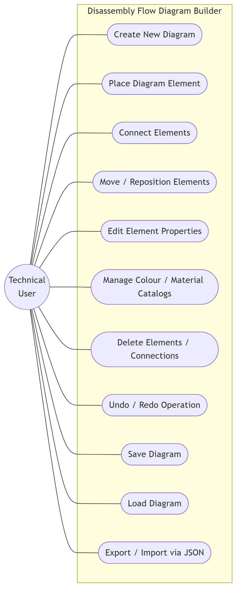

Main use cases:

- Create New Diagram
- Place a Diagram Element (Component, Step, Action, Decision)
- Connect Elements
- Move / Reposition Elements
- Edit Element Properties (name, weight, colour, material, tool, image)
- Manage Colour and Material Catalogs
- Delete Elements / Connections
- Undo/Redo Editing Operation
- Save Diagram
- Load Diagram
- Export / Import Diagram via JSON

###  4.2 Dynamic Models

This section describes the dynamic behaviour of the system using activity, sequence, and state diagrams.

####  4.2.1 Activity Diagram: Add a new component node

This activity diagram describes the flow for adding a component node to the canvas. The user clicks to create a node; the `AppController` instantiates the corresponding `ComponentBox`, determines its position on the grid, logs the action in the `CommandHistory` registry (so it can be undone later), and tells the `DiagramCanvas` to draw the new block.

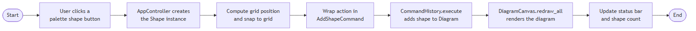

####  4.2.2 Sequence Diagram: Create an arrow connection

This sequence diagram describes how two diagram elements are linked. The user enables the connection tool and clicks a source node; the canvas shows a real-time preview line following the cursor. Once a valid target node is clicked, the controller calculates the best anchor points, invokes `_create_arrow_connection()` to create an `ArrowShape` and its underlying `Connection`, and pushes the transaction onto the `CommandHistory` stack.

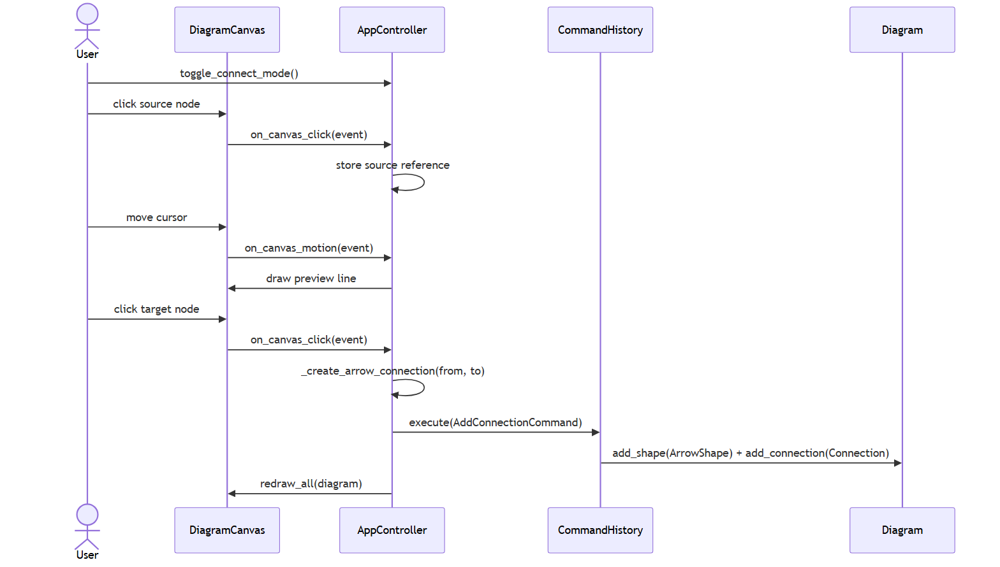

#### 4.2.3 Sequence Diagram: Export diagram to portable JSON

This sequence diagram shows how the open diagram is saved into an external JSON file:

1. The user selects the **Save / Export to JSON** option from the application menu.
2. The UI forwards the action to the central `AppController`.
3. `AppController` works with `DiagramSerializer` to read the active diagram state and pack it into a structured data map.
4. The diagram loops through its shapes and connections, encoding metadata, node dimensions, and property dictionaries into key-value maps.
5. The maps are handed to `DiagramSerializer.save_to_file()`, which converts them to JSON text and writes them to disk.
6. On successful write, the controller sets `diagram.modified = False` and renders a confirmation notification on the status bar.

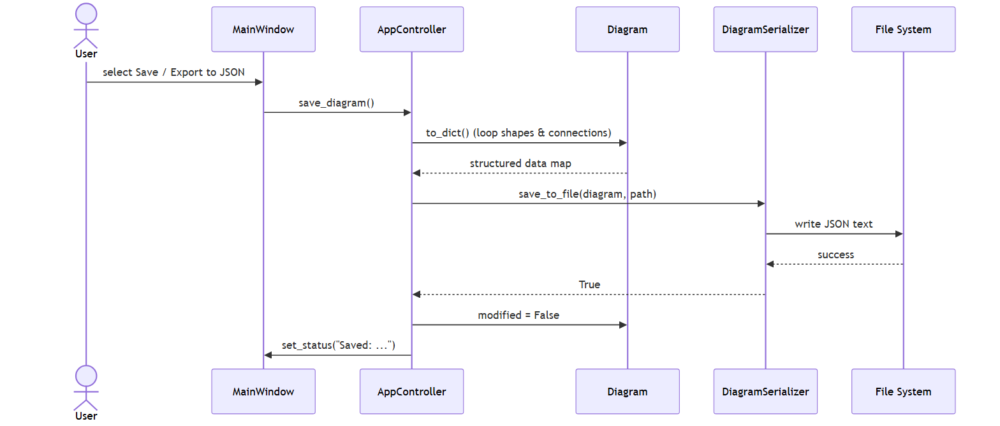

#### 4.2.4 Sequence Diagram: Load Diagram

This sequence diagram describes how a saved diagram is loaded from a JSON file. The `DiagramSerializer` validates the file structure, reconstructs the diagram objects and connections, rebuilds database links, and the `DiagramCanvas` is refreshed.

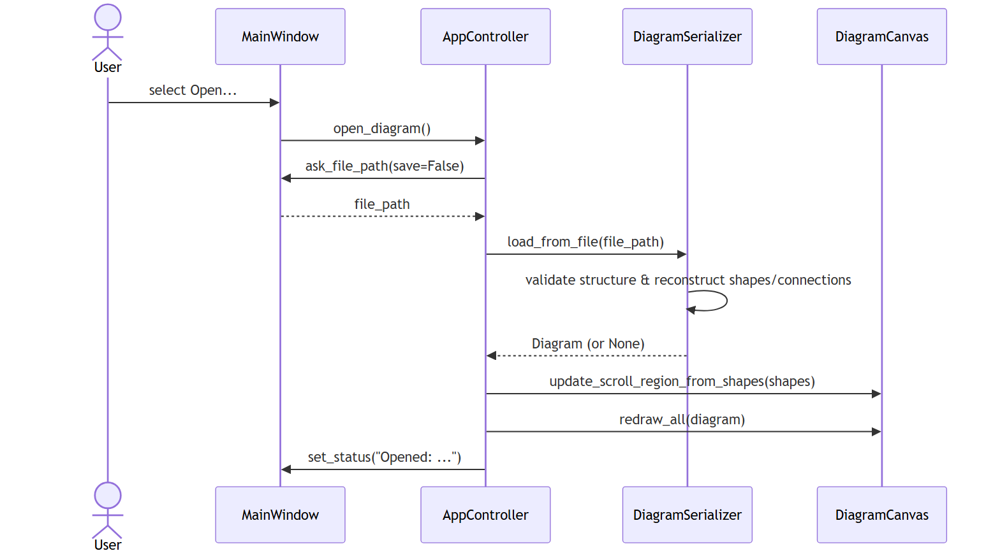

####  4.2.5 State Diagram: Diagram file lifecycle

This state diagram tracks the file status of an active `Diagram` instance in memory:

- **Unsaved:** a newly generated graph or a modified workflow whose state has not yet been written to disk.
- **Saved:** all modifications have been serialised to the database or exported to JSON.
- **Modified:** a previously saved diagram that has received new edits or node movements, switching `diagram.modified` to `True` and making it out of sync with the disk file.

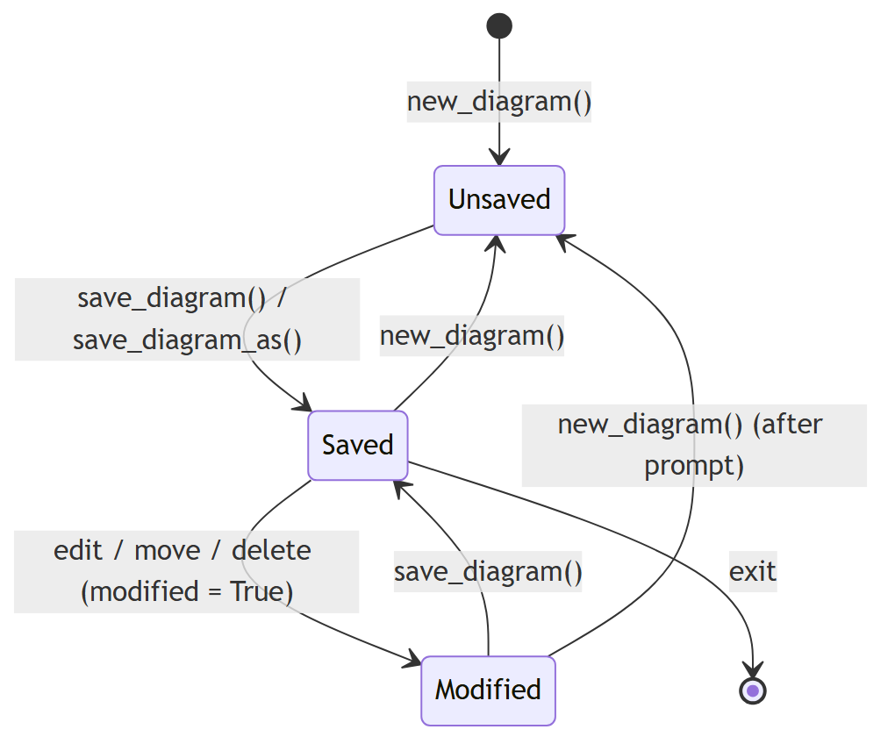

#### 4.2.6 State Diagram: Component shape lifecycle

This state diagram tracks the journey of a single `Shape` from creation to removal:

- **Instantiated:** the object exists in memory but is not yet added to the active diagram.
- **Idle:** the node is rendered normally inside the `DiagramCanvas`.
- **Selected:** clicked by the user; a highlight box appears and the `PropertiesPanel` loads its fields from the SQLite database.
- **Dragging:** the node tracks the mouse cursor across the canvas.
- **Dropped:** on mouse release, `snap_to_grid` aligns the shape to the nearest grid intersection.
- **Deleted:** the shape is removed from the diagram and saved data via a reversible command.

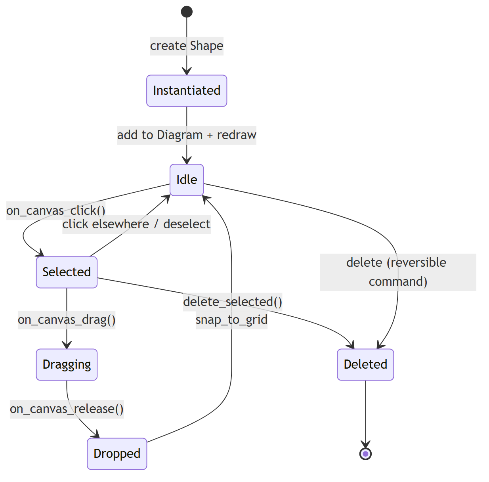
